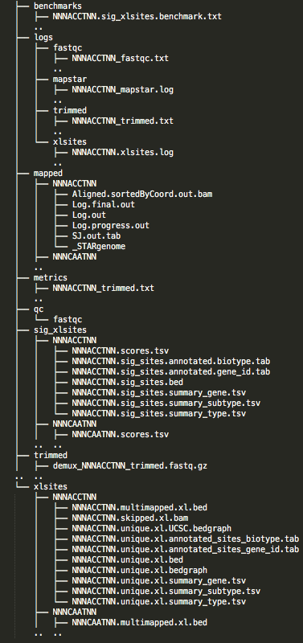
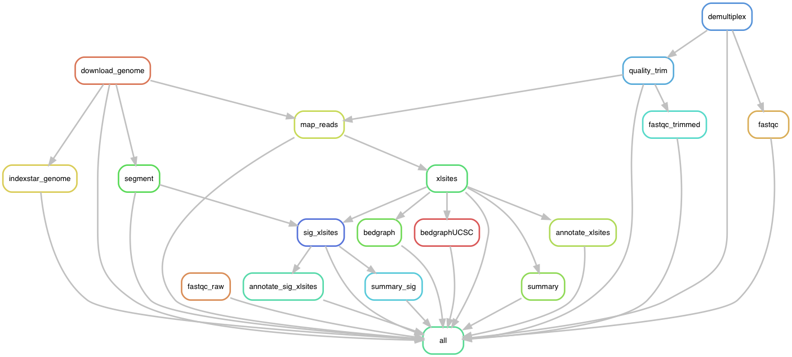

# iCount snakemake pipeline

## Authors 

Igor Ruiz de los Mozos, Charlotte Capitanchik, .... Tomaz Curk
Last updated: Nov 2019


## Installation

Activate conda environment with Snakemake, iCount and dependencies installed
Create new environment
```
conda env create --name iCount_pipeline --file envs/environment_iCount.yaml
conda activate iCount_pipeline
```

Install iCount 
```
pip install ./iCount/
Check the install
iCount
```

## run locally
To run locally use command:
```
snakemake -k -p --cores 4 --snakefile iCount_snakefile.smk --use-conda
```

## Run in SLURM

To run in a cluster use command:
```
sbatch -J iCount_main -o iCount_%A.out -N 1 -t 3-00:00:00 --wrap="snakemake -k -p --snakefile iCount_snakefile.smk --jobs 99 --use-conda --cluster-config envs/cluster_slurmn.yaml --cluster 'sbatch -J {cluster.name} -N {cluster.n} -c {cluster.c} --mem={cluster.memory} -t {cluster.time} -o {cluster.output} -e {cluster.error}'"
```

Dry run
```
snakemake -k -p -n -r --snakefile iCount_snakefile.smk.smk --use-conda
```
Unlock directory
```
snakemake --unlock -k -p --snakefile iCount_snakefile.smk.smk
```

## Run in SGE
```
Todo
```

## Output directories stile



## Pipeline schema



## Testing

